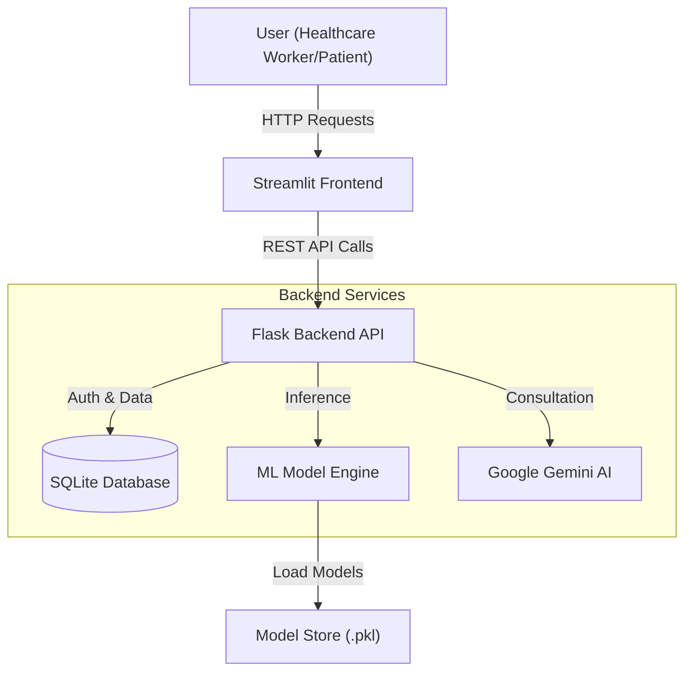

# System Architecture

## High-Level Overiew

PreventVance AI follows a decoupled Client-Server architecture, designed for scalability and maintainability. The system consists of a Streamlit-based frontend for user interaction and a Flask-based REST API backend that handles business logic, machine learning inference, and database operations.

## Component Details

### 1. Frontend Layer
*   **Technology**: Streamlit
*   **Role**: Provides an interactive dashboard for Healthcare Workers (Admins) and Patients.
*   **Key Features**:
    *   **Admin Dashboard**: Patient registration, multi-disease assessment forms (Diabetes, Heart, Liver, Mental Health), and visualizations.
    *   **Patient Dashboard**: View personal health records and risk reports.
    *   **State Management**: Handles user sessions and form data locally before submission.

### 2. Backend Layer
*   **Technology**: Flask (Python)
*   **Role**: Serves as the central API gateway.
*   **Key Responsibilities**:
    *   **Authentication**: JWT-based login and session management for Admins and Patients.
    *   **Request Handling**: Validates input data from the frontend.
    *   **Orchestration**: Coordinates between the Database, ML Engine, and External AI services.

### 3. Data Storage
*   **Technology**: SQLite (Development), SQLAlchemy ORM
*   **Role**: Persistent storage for all application data.
*   **Schema**:
    *   `Users`: Admin and Patient credentials.
    *   `Patients`: Demographics and medical history.
    *   `HealthRecords`: Historical assessment data and risk scores.

### 4. Machine Learning Engine
*   **Technology**: Scikit-Learn, LightGBM, XGBoost, Joblib
*   **Role**: Performs real-time disease risk prediction.
*   **Workflow**:
    1.  **Preprocessing**: Raw input is cleaned, scaled, and feature-engineered (e.g., calculating BMI, interaction terms) to match training data.
    2.  **Inference**: Pre-trained models loaded from the `models_store` generate probability scores.
    3.  **Post-processing**: Probabilities are converted into risk categories (Low, Medium, High).

### 5. AI Recommendation Service
*   **Technology**: Google Gemini 2.0 Flash API
*   **Role**: Generates personalized lifestyle advice.
*   **Logic**: Analyzes the calculated risk profile (e.g., "High Risk for Diabetes") to generate actionable tips on Diet, Exercise, and Sleep.

## Data Flow

1.  **Input**: User fills out a health assessment form on the Streamlit dashboard.
2.  **Transmission**: Data is sent via POST request to the specific backend endpoint (e.g., `/api/v1/predict/diabetes`).
3.  **Processing**:
    *   The backend authenticates the request.
    *   The `services.py` module preprocesses the data (calculates BMI, encodes categoricals).
4.  **Prediction**: The loaded ML model predicts a risk probability.
5.  **Persistance**: The result is saved to the SQLite database.
6.  **Enrichment**: (Optional) The result is sent to Gemini AI to generate a textual recommendation.
7.  **Response**: The risk score and recommendations are returned to the frontend for display.
